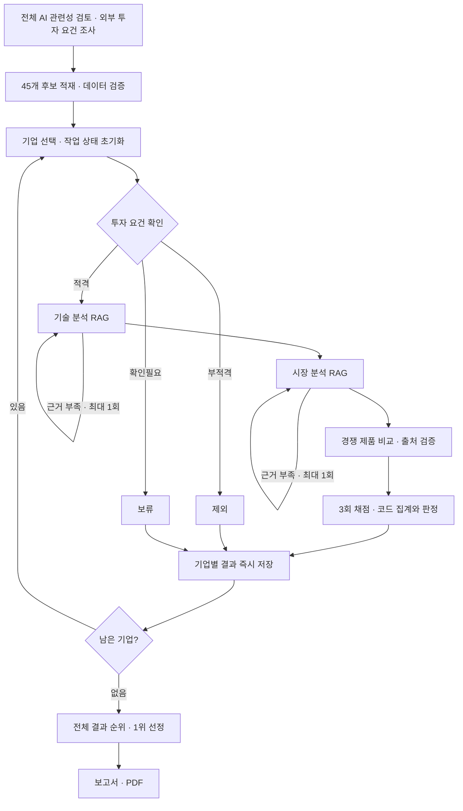

# AI 반도체 스타트업 투자 평가

기업 디렉토리북의 시스템반도체 분야 **45개사 전체를 평가**하고, 투자 적격 기업 중 1위의 보고서를 만드는 Agentic RAG 프로젝트다. 특정 기업을 지정하거나 투자 판정을 강제하지 않는다. 적격 기업이 없으면 미선정 사유를 담은 별도 보고서를 만든다.

[SKALA 팀 프로젝트](https://github.com/kimhynsoo/skala-rag)를 기반으로 실행 안정성·근거 검증·보고서 품질을 개선하는 개인 저장소다. 원천 자료와 설계·임베딩 비교 실험은 팀 작업을 이어 사용한다.

## 실행

Python 3.11과 uv를 사용한다. PDF 생성에는 Google Chrome 또는 Chromium이 필요하다.

```bash
git clone https://github.com/piw0814-create/skala-rag-personal.git
cd skala-rag-personal
uv sync --locked
cp .env.example .env
# .env에 OPENAI_API_KEY, TAVILY_API_KEY, DART_API_KEY 입력

uv run python app.py --prepare --pdf
uv run python -m tools.audit_results
```

`--prepare`는 AI 관련성 검토와 DART·Tavily 조사를 먼저 진행한 다음 전체 평가를 실행한다. 기업 입력과 날짜 조건이 맞는 조사·검색 캐시는 재사용한다. 분석과 채점은 실제 API와 문서 검색으로 실행한다. 이미 조사를 끝냈다면 `--prepare`를 생략할 수 있다.

```bash
# 기준일을 지정한 전체 실행
uv run python app.py --prepare --as-of 2026-09-30 --pdf

# 중단된 실행을 저장 완료 기업 다음부터 재개: 원래 기준일을 그대로 사용
uv run python app.py --resume --as-of 2026-09-30 --pdf

# 평가 결과는 유지하고 보고서 문장·PDF만 다시 생성
uv run python app.py --report-only --pdf

# 완료한 전체 분석은 유지하고 점수 산출 기업들을 모두 다시 채점
uv run python app.py --rescore --pdf

uv run pytest -q
```

기준일은 근거의 날짜·유효기간 검사에 쓰인다. 과거 날짜를 지정해 당시 웹 상태를 재현하는 기능은 아니다. 전체 실행 시간은 적격 기업 수, 검색 캐시, API 응답 시간에 따라 달라진다.

## 흐름



분석 오류가 발생하면 해당 기업을 보류하고 다음 기업을 진행한다. 분석 오류는 점수 미달과 구분해 결과에 남긴다. 모든 후보의 적격성을 확인하되, 투자 요건을 통과한 기업에만 기술·시장·경쟁 분석과 채점을 수행한다.

## 평가와 근거

- 가중치: 창업자 20 · 시장성 20 · 제품/기술력 30 · 경쟁 우위 15 · 실적 15.
- **총점 70점 이상 + 기술력 평균 3.0 이상 + 적격성 통과**를 모두 만족해야 투자 적격이다.
- 같은 입력을 3회 채점하고 항목별 중앙값을 사용한다. 점수는 실행마다 달라질 수 있으며 회차별 총점 범위를 저장한다.
- 실제 원문 레코드에 없는 근거 ID는 제거한다. 유효한 근거가 없는 판단은 확인불가, 점수는 2점이다. 매출·투자 유치는 기업의 숫자 데이터에서 코드로 계산한다.
- 경쟁사 사양은 확보한 원문 인용에서 확인된 값만 남긴다. 비교표는 제품·지표명·값이 맞아야 유지하며, 검증 실패한 비교와 그에 의존한 우위·열위 주장을 제외한다.
- 보고서는 저장된 평가 결과만 사용한다. 투자 누적 금액과 개별 라운드를 구분하고, 경력 기간·TRL을 추정하지 않는다. 본문에서 인용한 출처만 REFERENCE에 넣는다.
- 경력 10년이 확인되지 않은 전문성·몰입도와, 검증된 성능 수치가 없는 고객 가치·문제 해결 효과는 정성적 근거 기준인 3점으로 제한한다. 확인된 장점을 유지하면서 최고점 조건으로 확대하지 않는다.
- 원문에 현재 납품·양산이 직접 명시된 제품은 개발 성숙도 기준에 반영한다. 예정·계획·부정 표현은 제외하고 TRL 숫자는 추정하지 않는다.
- 매출 표는 연도·지역별 칸을 고정 순서로 읽어 `-`를 건너뛰지 않는다. 해외 금액의 K·M과 원화·달러 병기를 구분한다. Q7은 최근 연도 매출로 코드 판정하며 1억 원 = 100,000천원이다.

## 결과 파일

| 파일 | 내용 |
|---|---|
| [outputs/report.pdf](outputs/report.pdf) | 최신 실행의 최종 보고서, 5쪽 이내 |
| [outputs/report.md](outputs/report.md) | 보고서 원문 |
| [outputs/evaluation_results.json](outputs/evaluation_results.json) | 전체 판정·점수·근거·오류·실행 이력; 기업별 중간 저장 |
| [outputs/evaluation_summary.md](outputs/evaluation_summary.md) | 전체 기업 결과표 |
| [outputs/validation.json](outputs/validation.json) | 총점·판정·순위·인용·PDF 페이지 수 재검증 |

검증을 마친 위 5개 결과 파일은 개인 저장소에 함께 보관한다. 새로 실행하면 이 파일들이 갱신되어 Git 변경으로 표시된다. API 키·검색 캐시·기타 임시 산출물은 Git에서 제외한다. PDF 변환 실패는 평가 결과와 Markdown을 보존하며, `--pdf` 실행은 실패로 종료한다. 내용은 자동으로 삭제하지 않는다.

## 구조와 문서

| 경로 | 역할 |
|---|---|
| `app.py` · `runtime.py` | 실행 옵션, 중간 저장·재개, 실행 요약 |
| `graph.py` · `state.py` · `config.py` · `schemas.py` | 흐름·상태·평가 기준·데이터 계약 |
| `agents/` · `prompts/` | 적재·적격성·기술·시장·경쟁·투자·보고서 |
| `rag/` · `tools/` | PDF 파싱, 문서 검색, 외부 조사, 결과 재검증 |
| `data/` | 원천 PDF 15개, manifest, 기업 레코드 |
| `eval/` | 팀의 검색 골든셋·임베딩 비교 실험 |
| `tests/` | 데이터 계약·검색·분기·채점·보고서·재개 검증 |
| `docs/` | 설계·실행 안내·트러블슈팅 |

[SETUP](docs/SETUP.md) · [전체 실행과 결과 점검](docs/FULL_PIPELINE.md) · [실제 실행 점검 기록](docs/VALIDATION.md) · [데이터 계약](docs/CONTRACTS.md) · [팀 설계정의서](docs/설계정의서.md) · [트러블슈팅](docs/TROUBLESHOOTING.md).

검색은 Chroma와 로컬 **BAAI/bge-m3 dense/sparse + RRF**를 사용한다. 팀의 18문항 실험에서 Hit@5 0.944, MRR@5 0.917을 기록했다. 작은 표본의 검색 결과이며 전체 평가 정확성을 보증하는 수치는 아니다. [비교 실험](eval/results.md).

## 팀 기여

김세령: PDF 파싱·기업 추출 / 김현수: 검색·임베딩 평가·그래프 설계 / 박세웅: 외부 적격성·경쟁사 분석 / 박인우: 기술·시장 RAG / 성재원: 투자 판단·보고서.
