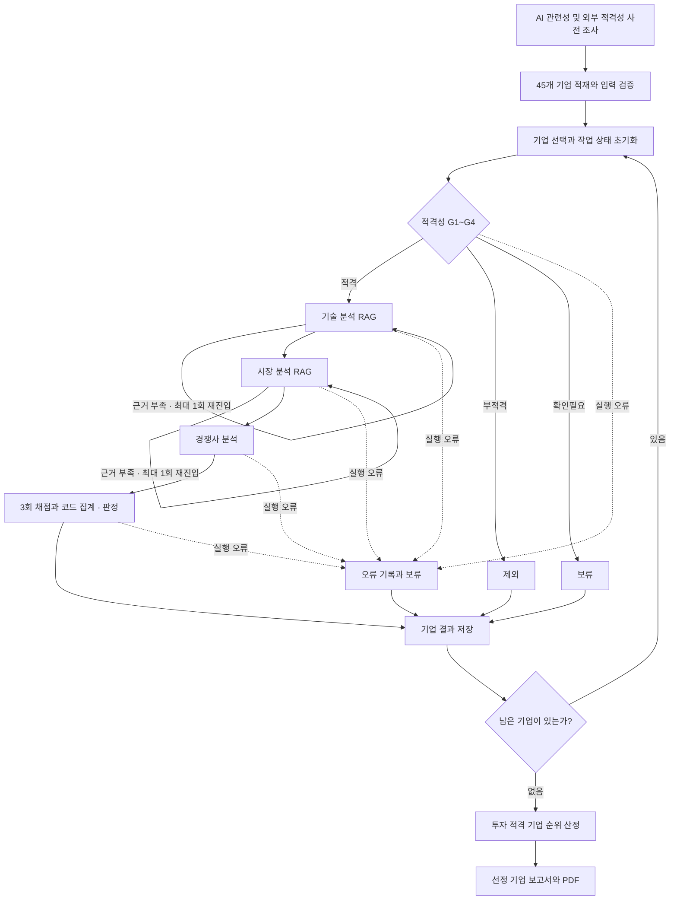

# AI 반도체 스타트업 투자 평가 — 프로젝트와 개인 기여 정리

작성자: 박인우  
정리 기준일: 2026-09-30  
팀 프로젝트 담당: D — 기술력·시장성 RAG 분석 및 재검색 흐름  
후속 작업: 개인 저장소에서 전체 실행·근거 검증·채점·보고서 품질 보완

이 문서는 현재 코드, 팀 설계 문서, 저장된 실제 실행 결과와 Git 이력을 근거로 작성했다. 팀에서 공동으로 만든 기능과 내가 담당한 구현, 팀 프로젝트 이후 개인 저장소에서 확장한 내용을 구분한다. 수치는 2026-09-30 실행의 기록이며, 이후 재실행 결과는 달라질 수 있다.

## 1. 프로젝트 전체 요약

### 한 문장 소개

**기업 원문과 반도체 기술·시장 자료를 연결하고, 근거가 부족하면 재검색하며, 확인된 사실을 평가와 보고서까지 추적하는 Agentic RAG 기반 스타트업 투자 평가 프로젝트다.**

| 항목 | 내용 |
|---|---|
| 배경 | SKALA 5인 팀 프로젝트. 교수님 과제의 투자 평가 기준과 팀 설계에 따라 구현 |
| 평가 대상 | 기업 디렉토리북의 시스템반도체 분야 45개사 |
| 원천 자료 | 기업정보·기술 기준·시장 자료 PDF 15개, 총 169페이지 |
| 핵심 기능 | 적격성 확인 → 기술·시장 RAG → 경쟁사 비교 → 점수 산출 → 전체 후보 비교 → 보고서 생성 |
| 주요 기술 | Python 3.11, LangGraph, LangChain, Pydantic, GPT-4.1-mini, BGE-M3, Chroma, dense/sparse 검색, RRF, PyMuPDF, DART, Tavily |
| 내 팀 역할 | 기술력·시장성 분석 에이전트, 한영 검색 질의, 근거 검증, 미확인 정보 기반 재검색 |
| 개인 확장 | 입력 매출 정정 반영·보완, 채점과 인용 검증, 실행 저장·재개, 전체 결과 감사, 보고서 표현·PDF 점검 |
| 최종 산출물 | 전체 기업 평가 JSON·요약표, 선정 기업 Markdown·5페이지 PDF, 검증 결과 JSON |
| 저장소 | [팀 저장소](https://github.com/kimhynsoo/skala-rag) / [개인 정리 저장소](https://github.com/piw0814-create/skala-rag-personal) |

### 해결하려는 업무 문제

스타트업을 평가하려면 기업 소개서의 주장, 기술의 실제 수준, 시장의 성장 가능성, 투자 단계와 매출을 함께 확인해야 한다. 자료마다 형식과 시점이 다르고, 한국어 기업 소개와 영어 기술 보고서를 연결해야 하며, 성능 숫자는 측정조건이 달라 단순 비교하기 어렵다.

이 과정에는 다음 문제가 있었다.

1. **자료가 흩어져 있다.** 기업의 제품 설명, 기술 표준, 시장 규모, 투자 이력이 서로 다른 자료에 있다.
2. **관련 자료를 찾았어도 평가에 바로 쓸 수 없다.** 전체 반도체 시장의 성장률이 특정 기업 제품의 직접 시장 성장률은 아니다.
3. **출처가 있어도 해석이 틀릴 수 있다.** 원문에 있는 숫자를 다른 연도·단위·측정조건으로 옮기면 잘못된 결론이 나온다.
4. **정보가 없을 때 판단이 과장될 수 있다.** 확인되지 않은 성능이나 경력을 LLM이 그럴듯하게 채우면 점수와 보고서가 왜곡된다.
5. **여러 기업을 끝까지 평가하기 어렵다.** 검색·API 호출이 많은 흐름에서 한 번의 오류나 중단이 전체 작업에 영향을 줄 수 있다.

프로젝트는 이 문제를 검색, 분석, 검증, 판정, 결과 저장으로 나누어 처리한다. 결과의 용도는 과제에서 정한 기준에 따른 **후보 검토와 추가 확인 사항 정리**다. 실제 투자 수익률이나 전문 심사역 판단과의 일치율을 검증한 프로젝트는 아니다.

## 2. Agentic RAG로 어떤 문제를 해결했는가?

### 이 프로젝트에서의 의미

RAG는 필요한 원문을 검색해 LLM 분석에 제공하는 방식이다. 이 프로젝트는 여기에 **분석 상태에 따른 다음 행동 선택**을 더했다. 기업마다 적격성 결과에 따라 진행 경로를 바꾸고, 분석 근거가 부족하면 누락된 항목을 중심으로 질의를 다시 만들며, 재검색 이후에도 부족한 정보는 미확인 상태로 남긴다.

자율성의 범위는 정해져 있다. LLM은 자료의 의미를 해석하고 허용된 검색 도구를 사용할 수 있다. 재검색 횟수, 다음 노드, 점수 집계, 투자 적격 판정은 코드가 통제한다. 따라서 이 프로젝트는 **LangGraph가 실행을 관리하고 LLM 에이전트가 일부 분석·도구 선택을 수행하는 워크플로**다.

| 업무 문제 | Agentic RAG에서의 처리 | 실제 구현 |
|---|---|---|
| 기업마다 확인할 기술과 시장이 다름 | 현재 기업의 제품·분야·기술 설명으로 검색 질의 생성 | D의 `build_query()` |
| 첫 검색으로 필요한 근거를 모두 얻지 못함 | 미확인 정보 중심으로 질의를 재작성하고 제한된 재검색 | D 분석 결과 + `graph.route_retry()` |
| 검색 결과가 충분한지 판단이 필요함 | LLM 자기평가와 코드의 원문·수치 검증을 함께 적용 | `근거충분`, `validate_analysis()` |
| 기업의 상태에 따라 필요한 작업이 다름 | 적격·부적격·확인필요·실행 오류에 따라 분기 | `graph.py`의 조건부 연결 |
| 기술 분석을 시장 평가에 연결해야 함 | 기술 분석을 다음 시장 노드의 입력으로 전달 | 공유 `State` |
| 결과를 검토하려면 판단 과정을 알아야 함 | 원문 근거 ID, 단계별 산출물, 점수 사유와 실행 이력 저장 | `current_evidence`, `evaluation_results` |

### 망고부스트를 예로 든 실제 흐름

1. 기업 원문에서 제품과 사업 내용을 읽고 투자 적격성 요건을 확인한다.
2. 기술 노드가 관련 기술 문서를 검색하고, 기업이 제출한 내용과 업계 자료를 구분한다.
3. 기업의 핵심 성능 수치나 측정조건을 충분히 확인하지 못하면 그 항목을 대상으로 재검색한다.
4. 시장 노드는 기술 분석을 이어받아 고객·사업모델·시장 자료를 검토한다. 직접 목표 시장 규모가 없으면 이를 확인불가로 남긴다.
5. 경쟁 분석과 투자 채점을 수행한다. 확인되지 않은 항목은 정해진 정책으로 처리하고, 총점과 최종 판정은 코드로 계산한다.
6. 나머지 후보도 끝까지 평가한 후 순위를 정하고 선정 기업의 보고서를 생성한다.

이번 실행에서는 망고부스트의 직접 목표 시장 규모, 핵심 성능 지표, 경쟁사 대비 차별성에 관한 미확인 항목이 남았다. **재검색은 없는 정보를 만들어내는 기능이 아니라, 추가로 찾아보고 여전히 모르는 것을 명확히 하는 기능**으로 사용했다.

### 왜 이 방식이 필요했는가?

투자 평가에는 서로 성격이 다른 작업이 함께 있다. 기업 소개서 해석에는 LLM이 유용하고, 기술 기준을 찾는 데는 검색이 필요하며, 매출 환산과 가중 총점에는 숫자 규칙이 필요하다. Agentic RAG는 이 작업들을 하나의 흐름으로 연결하고 현재 상태에 맞게 필요한 작업을 진행하도록 했다.

단계가 명확해지면서 “잘못된 입력인지, 검색이 부족한지, 구조화 응답이 깨진 것인지, 채점 규칙의 문제인지”를 나누어 점검할 수 있었다. 다만 재검색·구조화 응답·검증 로직이 추가되어 구현 복잡도와 API 호출 수가 늘었다. 그래서 재검색 제한과 중간 저장을 함께 적용했다.

## 3. 팀 역할과 내 기여 범위

### 팀 구성

| 담당 | 팀원 | 주요 역할 | 내 작업과의 관계 |
|---|---|---|---|
| A | 김세령 | PDF 파싱, 기업 레코드 추출, 문서 메타데이터 | D가 분석할 기업 원문과 분야 정보 제공 |
| B | 김현수 | 검색·임베딩 비교, 하이브리드 검색, 그래프 설계 | D가 `hybrid_search()`와 검색 도구 사용 |
| C | 박세웅 | 외부 적격성 검증, 경쟁사 분석 | 적격 기업을 D로 전달하고 D 산출물을 경쟁 분석에 활용 |
| **D** | **박인우** | **기술력·시장성 분석, 근거 검증, 재검색 흐름 연계** | **내 직접 담당 구현** |
| E | 성재원 | 투자 판단, 점수 산출 연계, 보고서 생성 | D 분석과 근거를 체크리스트·점수·보고서에 활용 |

### 팀 프로젝트에서 직접 담당한 부분

- `agents/technology.py`, `agents/market.py`의 분석 진입점 구현.
- 공통 분석 로직 `agents/_rag_utils.py` 구현.
- `prompts/technology.md`, `prompts/market.md` 작성.
- 기업 제품·기술 분야를 반영하는 한국어·영어 검색 질의 생성.
- 최초 검색에서 부족했던 항목을 대상으로 재검색 질의 재작성.
- 기업 원문·기술 문서·시장 문서의 근거 ID 연결과 중복 제거.
- 수치·단위·원문 인용·측정조건·시장 범위·발행 시점 검증.
- 기술·시장 분석의 구조화 결과를 공용 데이터 계약에 맞춰 반환.
- D 단위 테스트와 그래프 연계 테스트 작성.

Git 이력상 직접 구현은 [`ab5a18b` — feat(D): 기술력·시장성 RAG 분석 에이전트 구현](https://github.com/kimhynsoo/skala-rag/commit/ab5a18bffc4749ba7ba1314de79833a1d9782a9d)에서 확인할 수 있다. 이 커밋 당시 검증은 실제 API 호출을 대체한 테스트를 포함한 **119개 테스트 통과**였으며, 이후 실제 실행 검증과 구분한다.

### 통합 과정에서 함께 해결한 부분

공용 LLM의 strict 구조화 출력, 내부 반복 제한, 검색 저장소의 환경 충돌 등은 팀 통합 과정에서 보완됐다. 특히 [`bba08ef` — strict 출력과 RAG 검증 실패 처리 안정화](https://github.com/kimhynsoo/skala-rag/commit/bba08ef54cd3d2d4fe357522246178892f3b295a)는 김현수의 후속 수정이다. 포트폴리오에서는 이 부분을 **실제 실행 중 문제를 확인하고 팀 수정과 통합한 경험**으로 설명한다.

### 개인 저장소에서 추가로 보완한 부분

팀 최종 코드를 별도 개인 저장소로 복사한 뒤, 원본 팀 저장소에 영향을 주지 않고 다음을 확장했다.

- 전체 후보를 끝까지 평가하는 실행과 결과 점검 정리.
- 팀원이 제시한 매출 표 파싱 수정의 반영과 추가 예외 처리·회귀 테스트.
- 실제 확보한 근거 레코드만 채점과 보고서에서 사용하도록 검증 강화.
- 확인되지 않은 경력·수치가 최고점 조건으로 확대되는 것을 제한.
- 경쟁사 비교의 원문 구절·지표·값 검증과 자기 회사의 별칭 제외.
- 기업별 중간 저장, 조건이 맞는 실행의 재개, 재채점·보고서 재생성 옵션.
- 결과 감사 도구와 최종 PDF 검수.
- 실행 결과·검증 자료·문서의 저장소 정리.

개인 확장은 [`4057180`](https://github.com/piw0814-create/skala-rag-personal/commit/405718071035b131cf7ab88e546229bfeb08ee6a)의 변경 파일에서 확인할 수 있다. 팀에서 이미 구현한 D 분석, 검색 엔진, 그래프의 기본 구조, E의 채점·보고서 기능을 기반으로 보완했다.

## 4. 시스템 구조와 실행 흐름

### 전체 흐름

사전 조사는 입력과 유효기간이 맞는 캐시를 재사용한다. 투자 적격 기업을 발견해도 후보 처리는 계속된다. 마지막에 모든 결과를 모아 선정하며, 투자 적격 기업이 없으면 미선정 사유 보고서를 생성한다.

기술·시장 노드의 최초 실행과 최대 1회의 재진입에 더해, 각 분석 호출 안에서 에이전트가 검색 도구를 한 번 추가로 사용할 수 있다. 따라서 “재검색 1회”는 **그래프 재진입 제한**을 뜻하며, 전체 검색 함수 호출이 정확히 두 번으로 고정된다는 뜻은 아니다.

### 계층별 구성

| 계층 | 주요 파일 | 책임 |
|---|---|---|
| 데이터 | `rag/parser.py`, `data/manifest.json`, `data/processed/companies.json` | PDF 레이아웃 복원, 기업 추출, 원본 페이지·문서 정보 보존 |
| 검색 | `rag/retriever.py`, `tools/retrieval.py` | 문서 필터, dense/sparse 검색, RRF 결합, 검색 근거 제공 |
| 분석 | `agents/eligibility.py`, `technology.py`, `market.py`, `competitor.py` | 적격성·기술·시장·경쟁 판단과 근거 생성 |
| 실행 제어 | `graph.py`, `state.py`, `app.py`, `runtime.py` | 분기, 상태 초기화, 후보 반복, 저장·재개 |
| 평가 | `agents/investment.py`, `_report_scoring.py`, `_scoring_grounding.py` | 항목별 채점 검증, 숫자 항목 계산, 가중 총점·판정 |
| 출력·검수 | `agents/report.py`, `_report_grounding.py`, `_report_render.py`, `_report_pdf.py`, `tools/audit_results.py` | 저장 결과로 보고서 구성, PDF 변환, 결과 일관성 검사 |

### 상태와 근거가 연결되는 방식

`State`에는 전체 후보, 현재 기업, 적격성, 기술·시장·경쟁 분석, 근거, 점수와 누적 결과가 들어간다. 기업을 바꿀 때 작업 상태를 초기화해 이전 기업의 분석과 인용이 섞이지 않게 한다.

근거는 식별자로 연결한다. 기업 원문은 `DIR-{기업ID}-...`, 기술 문서는 `TEC-{chunk_id}`, 시장 문서는 `MKT-{chunk_id}` 형식을 사용한다. 분석 항목이 어떤 출처를 사용했는지 기록하고, 마지막 보고서의 참고문헌까지 연결한다.

단, **근거 ID가 존재한다는 사실만으로 주장이 맞다고 판단하지 않는다.** 해당 원문에 수치와 단위가 실제로 있는지, 필요한 측정조건이 확인되는지, 그 자료가 주장하는 시장 범위와 일치하는지를 별도로 검사한다.

### 평가 규칙

- 적격성: G1 비상장, G2 최신 투자 단계 Series C 이하, G3 Exit 이전, G4 AI 관련 사업.
- 세부 평가: 5개 대분류 × 3개 항목 = 15개 항목, 각각 1~5점.
- 가중치: 창업자 20, 시장성 20, 제품/기술력 30, 경쟁 우위 15, 실적 15.
- 총점: 각 대분류 평균을 5점으로 나눈 뒤 가중치를 곱하여 합산, 소수 첫째 자리로 반올림.
- 투자 적격: **적격성 통과 + 총점 70점 이상 + 기술력 평균 3.0 이상**.
- 확인불가: 정해진 정책에 따라 2점으로 처리하고 해당 항목을 따로 표시.

LLM은 항목별 점수와 이유를 제안한다. 총점·최종 판정은 코드가 계산하고, 매출·투자 유치처럼 숫자로 판단할 수 있는 항목도 코드로 산출한다. 3회 채점 후 항목별 중앙값을 적용하며 실행별 점수 범위를 남긴다.

## 5. 내가 구현한 D의 논리 흐름

### 입력과 출력

| 구분 | 기술 분석 | 시장 분석 |
|---|---|---|
| 입력 | 현재 기업, 제품·기술분야·혁신성, 기업 원문, 기술 검색 결과, 이전 분석 | 현재 기업, 고객·사업모델, 기업 원문, 앞 단계 기술 분석, 시장 검색 결과, 이전 분석 |
| 검색 범위 | 기술 문서 02~11, 기업의 `sub_domain` | 시장 문서 12~15, `doc_type=market` |
| 출력 | 핵심기술, 제품 단계·TRL, 성능지표, 기준대조, 강점·한계, 미확인정보, 근거ID, 근거충분 | 목표고객, 시장규모·기준연도, 성장률·기간, 사업모델, 글로벌확장성, 성장요인·위험, 미확인정보, 근거ID, 근거충분 |

### 처리 과정

1. **입력 계약 확인**: 현재 기업의 ID와 기술 분야가 유효한지 확인한다. 다른 담당자가 만든 분야 정보를 임의로 다시 분류하지 않는다.
2. **검색 질의 생성**: 기업 제품과 설명을 유지하면서 관련 영어 기술·시장 용어를 추가한다. CXL·UCIe 등 명시된 제품 프로토콜을 반영한다.
3. **하이브리드 검색 호출**: B의 검색 함수를 사용하고 문서 유형·분야 필터와 top-k 5를 적용한다.
4. **원문 근거 연결**: 기업 원문과 검색한 전체 청크를 분석 입력에 넣는다. 짧은 발췌만으로 보이지 않는 수치를 추정하지 않도록 한다.
5. **구조화 분석**: 기술·시장 분석과 함께 수치의 원문 구절, 기술 비교 조건 또는 시장 범위 검증 정보를 받는다.
6. **코드 검증**: 스키마, 실제 근거 ID, 인용 구절, 숫자·단위, 출처 종류, 비교 조건, 시장 범위와 시점을 검사한다.
7. **부족한 항목 기록**: 증거가 부족하면 해당 수치를 비우거나 비교불가로 두고, 필요한 항목을 `미확인정보`에 추가한다.
8. **재검색 연계**: 검증된 `근거충분`과 시도 횟수를 그래프에 반환한다. 재진입하면 최초 질의 전체를 반복하지 않고 미확인 항목 중심으로 다시 검색한다.
9. **후속 단계 전달**: 최대 재검색 이후에도 부족한 정보는 그대로 남겨 경쟁 분석과 E의 채점이 불확실성을 인식하도록 한다.

### 구현에서 중요하게 본 기준

- 기업이 주장한 성능은 기업 원문에서, 업계 기준은 기술 자료에서 확인한다.
- TRL 숫자는 원문에 직접 명시된 경우만 사용한다. 시제품·납품 문구만 보고 숫자를 만들어 넣지 않는다.
- 수치가 확인되었더라도 비교 조건이 부족하면 값을 유지하고 우열 판단만 비교불가로 둔다.
- TOPS/W, GT/s, GB/s 등 서로 다른 지표와 단위를 구분한다.
- 성능 비교에서는 정밀도·공정·워크로드·측정방식, 링크폭·방향 등의 조건을 확인한다.
- 시장 수치는 세그먼트·지역·기준연도·실적/전망 여부를 확인한다. 전년 대비 성장률을 CAGR으로 바꾸지 않는다.
- 상위 시장 수치는 성장 배경에 활용하되 기업의 직접 목표 시장 규모로 옮기지 않는다.
- 조사 기준일 이후 발행된 자료는 제외한다. 이전에 발행된 보고서의 미래 전망은 전망으로 표시해 사용할 수 있다.
- 내부 검증 필드와 팀에 전달할 공용 분석 필드를 구분해 다른 에이전트의 데이터 계약을 유지한다.

## 6. 왜 이 기술을 사용했는가?

| 기술·설계 | 해결하려는 문제 | 사용 방법과 선택 이유 | 고려한 제약 |
|---|---|---|---|
| Agentic RAG | 첫 검색만으로 평가 근거가 완성되지 않음 | 분석 결과의 미확인 정보를 다음 검색에 반영 | 재검색을 해도 원천 자료의 공백은 남을 수 있음 |
| LangGraph | 여러 단계·기업 반복·조건 분기를 관리해야 함 | 적격성, 근거충분, 오류 상태에 따라 다음 노드를 코드로 결정 | 상태 초기화와 종료 조건이 잘못되면 결과가 섞이거나 반복될 수 있음 |
| LangChain | 검색 도구와 구조화 LLM 호출을 에이전트에 연결해야 함 | 공용 호출 함수와 도구 인터페이스를 사용해 담당자별 구현 연결 | 내부 에이전트 반복과 바깥 그래프 반복을 따로 제한해야 함 |
| GPT-4.1-mini | 비정형 소개서·기술 문서의 의미를 해석해야 함 | 한국어 구조화 분석과 항목별 채점에 사용한 공통 모델 | 비용·응답 시간·결과 변동이 있으며 모델별 비용 비교는 별도 수행하지 않음 |
| Pydantic·strict 출력 | 필드 누락·잘못된 타입이 다음 에이전트로 전달될 수 있음 | 응답 스키마, 허용 값, 필수 필드를 강제 | 형식이 맞아도 의미가 틀릴 수 있어 원문 검증을 추가 |
| BGE-M3 | 한국어 기업 설명을 영어 기술 자료와 연결해야 함 | 같은 모델로 dense 의미 검색과 sparse 토큰 검색 수행 | 팀 비교 실험에 기반한 선택이며 모든 질의 유형에서 우세한 것은 아님 |
| dense + sparse + RRF | 의미 유사성과 CXL·UCIe 같은 정확한 용어를 함께 찾아야 함 | 두 검색의 순위를 가중치 0.5/0.5로 결합 | 결합 결과도 분야 필터와 원문 검증이 필요 |
| Chroma | 로컬 벡터 저장·메타데이터 필터가 필요하고 FAISS 환경 충돌이 발생 | 팀에서 dense 저장소를 교체하고 인덱스를 캐시 | 모델·자료·메타데이터가 달라지면 색인 갱신 필요 |
| 700자 청크·100자 중첩 | 검색 단위를 줄이면서 앞뒤 문맥을 일정 부분 보존해야 함 | 팀에서 정한 공통 청킹 조건 사용 | 표·그림 구조가 완전히 보존되지 않을 수 있음. BGE-M3의 긴 입력 창을 쓰기 위한 선택은 아님 |
| PyMuPDF·정해진 표 파싱 | 다단 PDF와 빈 칸 때문에 데이터가 잘못 추출됨 | 위치·텍스트를 읽고 지원되는 매출 표는 칸 순서로 처리 | 지원되지 않는 4개 표는 기존 추출값 유지 |
| DART·Tavily | 소개서만으로 현재 상장·투자·Exit 상태를 알기 어려움 | 외부 기업 정보와 웹 자료를 조회해 적격성·경쟁 정보 보완 | 동명 기업·자료 누락·최신성 문제가 남을 수 있음 |
| 원문 근거 ID·구절 검증 | 출처가 있는 것처럼 보이는 허위 수치가 전달될 수 있음 | 실제 레코드와 인용 구절·값·단위·조건을 연결 | 문자열·규칙 검증으로 원문 전체의 사실성까지 보증하지는 못함 |
| 코드 기반 계산·판정 | 금액 환산·가중 총점·임계값을 LLM이 잘못 계산할 수 있음 | E2/E3/Q7, 총점과 판정을 함수로 계산 | 기준 자체는 과제·팀 설계의 정책이며 외부 성과로 검증된 모델은 아님 |
| 3회 채점·중앙값 | 같은 자료의 정성적 점수가 실행마다 달라짐 | 팀 E 구현의 반복 채점과 코드 집계를 유지 | 변동을 줄이는 장치이며 완전한 재현성을 보장하지 않음 |
| 스냅샷·입력 서명 | 실행 중단 후 완료 결과를 잃거나 다른 버전과 섞을 수 있음 | 기업별 원자적 저장, 입력·코드·기준 검사 후 재개 | 진행 중인 기업 내부부터 이어가는 기능은 없음 |
| pytest·결과 감사 | 함수 테스트만으로 실제 보고서의 정합성을 확인하기 어려움 | 회귀 테스트와 저장 결과의 총점·판정·근거·PDF 검사 병행 | 테스트 통과와 실제 평가 판단의 정확성은 구분 |
| Markdown·HTML/SVG·Chrome PDF | 같은 평가 결과를 읽기 쉬운 보고서로 제출해야 함 | E의 출력 구조를 이어받아 표·차트·참고문헌 생성과 PDF 변환 | 페이지 수와 시각적 배치에 별도 확인 필요 |
| uv·잠금 파일 | 팀원마다 다른 패키지 환경으로 실행이 달라질 수 있음 | Python 3.11과 `uv sync --locked`로 공통 환경 사용 | OS·모델 다운로드·외부 API 응답의 차이는 별도 관리 |

## 7. 프로젝트 전체를 STAR로 설명

### S — Situation: 어떤 상황이었는가?

기업 디렉토리북과 반도체 기술·시장 보고서를 활용해 스타트업을 평가하고 투자 후보 보고서를 만들어야 했다. 후보는 45개사였으며, 자료는 한국어 기업 소개와 영어 기술·시장 문서가 섞여 있었다. 소개서의 기술 주장만으로는 경쟁력을 판단하기 어려웠고, 정보 누락·단위 혼동·측정조건 차이도 처리해야 했다.

### T — Task: 내가 맡은 과제는 무엇이었는가?

5인 팀에서 D를 맡아 기업 주장을 관련 기술 기준과 시장 자료에 연결하는 분석 에이전트를 구현했다. 기술·시장 분석을 공용 스키마로 반환하고, 필요한 근거가 부족하면 재검색할 수 있도록 해야 했다. 이후 개인 저장소에서는 팀 코드의 전체 실행을 검증하고 입력 데이터부터 최종 보고서까지 정합성을 보완했다.

### A — Action: 무엇을 어떻게 했는가?

기업 제품과 기술 분야를 반영하는 한영 검색 질의를 만들고 팀의 하이브리드 검색을 연결했다. 기술·시장 분석을 구조화하고, 각 수치에 실제 원문 구절과 근거 ID를 요구했다. 코드에서 단위·측정조건·시장 세그먼트·기간을 검증하고, 부족한 항목은 미확인 정보로 남겨 제한된 재검색에 활용했다.

통합 실행에서는 반복되는 구조화 응답 오류를 확인하고 팀의 strict 출력·반복 제한 수정과 연결했다. 개인 저장소에서는 팀원의 매출 파싱 수정을 반영·보완했으며, 숫자 판정과 인용 검증, 중간 저장·재개, 채점·보고서 감사와 PDF 검수를 추가했다.

### R — Result: 무엇이 확인되었는가?

최종 실제 실행에서 45개사의 적격성 검토와 결과 저장을 완료했고, 적격성 통과 4개사에 실제 검색·LLM 기반 분석과 채점을 수행했다. 투자 적격 1개사, 보류 17개사, 제외 27개사로 정리됐으며 기록된 분석 오류는 0건이었다. 전체 테스트 216개와 결과 감사를 통과하고 5페이지 최종 보고서를 확인했다.

내 기여의 핵심은 **기술·시장 분석에 검증 가능한 근거와 미확인 상태를 도입하고, 그 정보가 최종 평가까지 이어지도록 연결한 것**이다. 확인되지 않은 정보를 억지로 채우기보다 자료의 한계를 결과에 드러내는 구조를 만들었다.

## 8. STAR 사례 1 — 기업에 맞는 검색과 재검색 흐름 구현

기여 구분: **팀 D 직접 구현**

### S

기업마다 AI 연산, 메모리·인터페이스, 공정 개선 등 제품 분야가 달랐다. 한국어 소개에 기반한 일반 질의만 사용하면 영어 기술 자료의 프로토콜·지표를 정확히 찾기 어렵고, 최초 검색 이후에도 측정조건이나 직접 시장 수치가 빠질 수 있었다.

### T

기업 제품을 기준으로 검색 범위를 정하고, 부족한 정보를 대상으로 다시 검색하는 D 분석 흐름을 구현해야 했다. A·B·E가 사용하는 데이터 계약과 검색 인터페이스도 유지해야 했다.

### A

- 기업의 제품명·기술분야·사업 설명을 유지하고 분야별 영어 검색 용어를 추가했다.
- CXL·UCIe가 명시된 제품은 해당 프로토콜의 속도·대역폭·패키지 조건을 질의에 반영했다.
- 기술 검색에는 `doc_type`과 A가 분류한 `sub_domain`을 적용했고, 시장 검색에는 시장 문서 유형을 사용했다.
- `미확인정보`와 `근거충분`을 구조화해 그래프가 재검색 여부를 판단하도록 연결했다.
- 재진입 시 최초 질의를 반복하지 않고 제품명과 누락 지표·조건을 중심으로 재작성했다.
- 이전 라운드의 전체 검색 원문을 보존하고 근거 ID를 중복 없이 연결했다.

### R

질의 재작성, 근거 중복 제거, 빈 검색의 제한된 재시도, 기업 변경 시 상태 초기화가 테스트로 확인됐다. 최종 실제 실행에서는 적격 4개사에 기술·시장 노드가 각각 8회 실행되어 최초 분석과 한 번의 재진입을 완료했다. 이후에도 확인되지 않은 항목은 결과에 유지됐다.

검색 정확도가 D 구현만으로 몇 퍼센트 개선되었다는 별도 실험은 하지 않았다. 이 사례의 성과는 **분석 결과에 따라 검색을 보완하고 종료하는 흐름을 실제 파이프라인에 연결한 것**이다.

근거: [`agents/_rag_utils.py`](../agents/_rag_utils.py), [`tests/test_rag_agents.py`](../tests/test_rag_agents.py), [`tests/test_rag_integration.py`](../tests/test_rag_integration.py), [실제 실행 기록](VALIDATION.md).

## 9. STAR 사례 2 — 출처가 있어도 틀릴 수 있는 수치·비교를 검증

기여 구분: **팀 D 직접 구현**  
사례 성격: 실제 원문 발췌를 활용한 검증 설계와 회귀 테스트. 아래 위험 예시가 모두 최종 보고서에서 실제 발생했다는 뜻은 아니다.

### S

검색한 자료에 관련 숫자가 있어도 기업의 실제 성능으로 사용할 수 있는 것은 아니었다. 업계 로드맵 전망, 서로 다른 프로토콜 수치, 전체 시장 규모가 기업의 성능이나 직접 목표 시장으로 옮겨질 위험이 있었다. 근거 ID 존재 검사만으로는 이런 의미 오류를 막을 수 없었다.

### T

“출처가 붙은 분석”을 넘어, 실제 원문이 해당 주장과 비교를 뒷받침하는지 확인하는 로직이 필요했다. 동시에 조건이 부족하다는 이유로 확인된 사실까지 모두 버리지 않아야 했다.

### A

- 내부 구조화 응답에 `수치근거`, `기술비교`, `시장검증` 정보를 추가했다.
- 모델이 복사한 인용 구절이 실제 원문에 존재하는지 확인하고 값·단위를 대조했다.
- 기업 성능에는 DIR, 업계 기준에는 TEC, 시장 수치에는 MKT 원문을 요구했다.
- 기술 비교에서는 같은 지표·단위와 필수 측정조건이 맞을 때만 상회·동등·하회를 계산했다. 지연시간·에너지처럼 낮을수록 좋은 지표의 비교 방향도 코드로 처리했다.
- WSTS의 전체 시장 수치를 특정 NPU 직접 시장으로 쓰는 경우, 전년 대비 성장률을 CAGR으로 바꾸는 경우, 전망을 실적으로 표현하는 경우를 검증했다.
- 원문 수치는 확인되지만 조건이 부족하면 수치를 유지하고 비교불가와 누락 조건을 기록했다.
- 검증된 원문이 있는데 필드별 ID만 빠진 경우에는 실제 원문을 근거로 연결을 보완했다.

### R

존재하는 ID에 허위 숫자를 붙이는 경우, 다른 출처 유형의 숫자를 가져오는 경우, CXL·UCIe 수치 혼동, IRDS 성장배수의 절대 성능 오용, 직접 시장 범위 혼동을 테스트로 다뤘다. 미확인 조건을 이유로 정상적인 수치까지 지우지 않는 처리도 함께 확인했다.

이 설계는 LLM의 자기평가를 그대로 믿는 대신 **확인된 수치와 비교 가능한 결론을 구분하는 구조**를 만들었다. 검증 로직은 명시된 지표·용어 규칙에 기반하므로 원문의 모든 의미를 이해하는 범용 사실 검증기로 보지는 않는다.

근거: [`validate_analysis()`·`_compare()`·`_market_scope()`](../agents/_rag_utils.py), [`tests/test_rag_grounding.py`](../tests/test_rag_grounding.py), [기술 프롬프트](../prompts/technology.md), [시장 프롬프트](../prompts/market.md).

## 10. STAR 사례 3 — 실제 실행이 오래 멈추는 구조화 응답 문제 점검

기여 구분: **직접 실행·진단 경험 + 팀 공용 수정의 통합**

### S

초기 실제 실행에서 첫 적격 기업의 기술 노드가 6분 이상 진행되지 않았다. 모델 다운로드와 임베딩 진행 메시지 이후 완료가 보이지 않았고, 실행을 중단하자 네트워크 응답 대기 경로가 나타났다. 이어서 상세 로그에서는 `GroundedTechnology` 응답의 필드 누락과 잘못된 위치가 반복됐다.

### T

다운로드·색인 시간, API 연결 문제, 응답 형식 재시도를 구분해야 했다. 그래프가 시작된다는 확인만으로 실제 분석이 정상이라고 판단하지 않고, 오래 대기하는 원인을 확인해야 했다.

### A

- 최소 LLM 호출을 분리해 응답 여부와 소요시간을 확인했다. “OK” 응답은 약 1.26초에 반환됐다.
- 실제 분석 호출 로그와 구조화 검증 피드백을 확인해 중첩 필드 오류가 반복되는 상황을 구분했다.
- 공용 구조화 호출에 대한 팀의 `ProviderStrategy(strict=True)`, 내부 반복 제한 12, 공통 요청 timeout 60초·최대 재시도 2 설정을 통합했다.
- 바깥 그래프의 반복 제한과 내부 LLM 에이전트의 반복 제한이 서로 다르다는 점을 문서에 남겼다.
- D에서 구조화 검증이 재시도 후에도 실패하면 분석을 폐기하고 부족한 정보를 기록하는 처리를 유지했다. 일반 실행 예외는 그래프에서 별도 오류로 기록한다.

### R

최종 실제 실행에서는 기술·시장·경쟁·투자 노드가 모두 진행됐고 기록된 분석 오류 없이 전체 후보 처리를 마쳤다. 정해진 반복 제한과 오류 처리로 진행 경로를 확인할 수 있게 됐다.

최소 호출 1.26초와 전체 분석 시간을 직접 비교해 성능 개선율을 산출하지는 않는다. 또한 개별 요청의 60초 제한이 전체 노드의 60초 완료를 보장하지 않는다. 여러 호출·재시도가 합쳐질 수 있다. strict 출력 안정화는 **팀원의 공용 수정**으로 명시한다.

근거: [`llm.py`](../llm.py), [트러블슈팅](TROUBLESHOOTING.md), [`bba08ef` 팀 수정](https://github.com/kimhynsoo/skala-rag/commit/bba08ef54cd3d2d4fe357522246178892f3b295a), [최종 실행 기록](VALIDATION.md).

## 11. STAR 사례 4 — 매출 표의 연도 오해석과 숫자 판정 보완

기여 구분: **팀원이 발견·제시한 매출 파싱 수정의 개인 저장소 반영과 보완**

### S

망고부스트 원문 매출 표에는 `-` 칸이 포함되어 있었다. LLM 추출에서 이 칸을 건너뛰면서 2024년 국내 매출 21,818천원이 2023년 값으로 이동했고, 최근 연도 매출이 확인불가로 처리됐다. 이후에는 21,818천원을 약 2억 원으로 잘못 읽는 체크리스트 판단 문제도 확인됐다.

| 칸 | 원문 |
|---|---|
| 2023 국내 | `-` |
| 2024 국내 | `21,818천원` |
| 2023 해외 | `$100,000` |
| 2024 해외 | `-` |

### T

원문 입력의 연도·지역 관계를 복구하고, 매출값이 점수·체크리스트·보고서에 일관되게 반영되도록 해야 했다. 팀원 수정의 의도를 유지하면서 다른 기업의 통화·표기 예외도 확인해야 했다.

### A

- 팀원이 제시한 원문 표의 고정 칸 순서 파싱을 반영해 빈 칸을 포함한 연도·지역 위치를 유지했다.
- 원문으로 다시 읽을 수 있는 기업은 매출만 정정하는 도구로 기존 JSON을 복구했다.
- 해외 금액의 K·M 표기와 원화·달러 병기를 구분하고, 확인되지 않은 환율을 임의로 적용하지 않았다.
- 읽을 수 없는 표는 기존 추출값을 유지하도록 했다.
- Q7과 E2를 실제 숫자 데이터에서 코드로 판정하고 결과 감사에서 서로의 값과 확인불가 표시를 검사했다.
- 입력 정정 후 전체 흐름을 다시 실행해 데이터 변경이 최종 보고서까지 이어지는지 확인했다.

### R

45개 원문 중 41개 표를 코드로 읽었고 C03·C07·C08·C18·C39의 매출을 정정했다. 정정 도구 재실행 시 변경 대상은 0개로 확인됐다.

망고부스트는 `21,818천원 = 21,818,000원 = 0.21818억 원`으로 읽혀 보고서에는 약 0.2억 원으로 표시됐다. 기존 기준에 따라 Q7은 1억 원 미만의 매출 발생을 뜻하는 PARTIAL이 됐다.

E2는 여전히 2점이다. 달라진 것은 “자료가 없어 2점”에서 **“확인 가능한 매출이 1억 원 미만이어서 2점”**으로 바뀐 이유와 확인불가 상태다. 이 수정으로 점수가 상승했다고 설명하지 않는다.

근거: [`rag/parser.py`](../rag/parser.py), [`rag/parse_revenue_repair.py`](../rag/parse_revenue_repair.py), [`agents/_report_scoring.py`](../agents/_report_scoring.py), [`tests/test_revenue_parse.py`](../tests/test_revenue_parse.py), [최종 보고서](../outputs/report.md).

## 12. STAR 사례 5 — 근거 부족이 채점과 보고서에서 사라지지 않게 보완

기여 구분: **개인 저장소 후속 개선**

### S

분석 단계에서 확인되지 않은 항목이 남아도 채점 단계가 그 의미를 충분히 반영하지 않으면 높은 점수가 붙을 수 있었다. 교수·박사라는 소개를 경력 10년 이상으로 확대하거나, 제품 효과 설명만으로 정량 성능이 검증된 것처럼 평가할 위험이 있었다. 보고서 문장이 저장된 점수·근거와 달라지는 문제도 점검해야 했다.

### T

이미 확인한 장점은 유지하면서 최고점의 필수 조건과 확인불가 항목을 구분해야 했다. 평가표·판정·보고서가 같은 입력과 기준을 사용하게 만들고 최종 결과를 검토 가능하게 남기는 것이 목표였다.

### A

- 분석 결과에 나열된 ID를 근거 존재의 증명으로 사용하지 않고, 실제 `current_evidence` 레코드만 허용했다.
- 유효한 근거가 없는 채점 항목은 확인불가로 처리하고 정책상 2점을 적용했다.
- 시장 규모·성장률 수치가 없는데 확인불가 표시만 해제되는 경우를 검사했다.
- 경력 기간과 검증된 성능 수치가 없으면 관련 최고점 조건을 제한했다. 정성적 장점은 유지했다.
- 납품·양산이 직접 명시된 원문은 제품 성숙도에 반영하되 계획·예정·부정 표현과 구분하고 TRL 숫자를 추정하지 않았다.
- 경쟁 비교에서 실제 원문 구절과 지표·값이 맞는지 검사하고, 자기 회사의 영어 별칭을 경쟁사로 넣지 않도록 했다.
- 보고서에는 저장된 선정 결과를 사용하고 확인된 팀 정보, 매출·투자 데이터, 미확인 항목을 반영했다.
- PDF의 매출 단위·체크리스트·제품명·차트 설명·참고문헌 배치를 다섯 페이지 모두 확인했다.

### R

이번 망고부스트 결과의 미확인 항목은 B1(목표 시장 규모·성장률), C3(핵심 성능 지표), D2(경쟁사 대비 차별성)로 남았다. 매출 E2는 미확인 목록에서 빠지고 작은 매출 규모를 설명하게 됐다.

총점·판정·유효 근거 ID·숫자 항목의 일치와 PDF 5페이지 제한을 결과 감사로 확인했다. 최종 72.0점은 이번 보완과 재실행의 결과이며, 이전 78·79점과의 차이를 특정 수정 하나의 효과로 단정하지 않는다. 목표는 점수를 높이는 것이 아니라 **확인한 사실과 점수·문장이 맞도록 만드는 것**이었다.

근거: [`agents/_report_scoring.py`](../agents/_report_scoring.py), [`agents/_scoring_grounding.py`](../agents/_scoring_grounding.py), [`agents/_report_grounding.py`](../agents/_report_grounding.py), [`tests/test_evidence_validation.py`](../tests/test_evidence_validation.py), [`outputs/validation.json`](../outputs/validation.json), [PDF](../outputs/report.pdf).

## 13. STAR 사례 6 — 전체 평가의 중단·재개와 완료 검증

기여 구분: **개인 저장소 후속 개선**

### S

전체 후보 평가에는 검색·외부 API·반복 채점이 포함돼 실행 시간이 길었다. 중간에 중단되면 이미 처리한 결과를 다시 만들 수 있고, 데이터나 프롬프트를 수정한 뒤 이전 결과와 새 결과가 섞일 위험도 있었다. 특정 기업의 분석 성공만으로 전체 파이프라인이 정상이라고 판단할 수 없었다.

### T

완료한 기업 결과를 보존하고 안전하게 이어 실행할 수 있어야 했다. 동시에 45개 후보 처리, 선정 규칙, 결과 저장과 보고서 생성까지 완료 여부를 확인해야 했다.

### A

- 기업 결과 저장 시 스냅샷을 기록하고 임시 파일 작성 후 교체해 JSON 저장 중 손상 위험을 줄였다.
- 원문·기업 JSON·분석 코드·프롬프트·설정·사전 조사 결과 등을 해시로 묶고, 기준일과 평가 기준도 검사했다.
- 서명이 같은 실행만 재개하도록 하고 저장 완료 기업 이후부터 진행하도록 연결했다.
- 완료 기업의 기록은 유지하되 저장하지 못한 기업의 이전 오류가 새 실행을 방해하지 않도록 처리했다.
- `--resume`, `--rescore`, `--report-only`를 목적에 맞게 구분하고 현재 기업·단계의 소요시간을 출력했다.
- 입력 누락·중복, 총점·평균·판정·순위·근거·매출 관련 값·PDF 페이지 수를 검사하는 감사 도구를 추가했다.

### R

최종 실행에서 45개 기업의 결과가 저장됐고 적격 기업이 나온 이후에도 나머지 후보를 계속 처리했다. 저장 결과를 대상으로 감사를 통과했으며 전체 테스트 216개가 통과했다. 재개와 버전 불일치 차단은 별도 테스트로 검증했다.

재개 기능은 저장 완료된 기업 다음부터 다시 진행한다. 실행 중이던 기업의 내부 API 호출 상태를 그대로 이어받지는 않는다. 전체 그래프 처리 시간 약 5분 48초는 유효한 조사·검색 캐시가 있는 이번 환경의 기록이다.

근거: [`runtime.py`](../runtime.py), [`app.py`](../app.py), [`tools/audit_results.py`](../tools/audit_results.py), [`tests/test_full_runtime.py`](../tests/test_full_runtime.py), [전체 실행 안내](FULL_PIPELINE.md).

## 14. 실제로 확인한 결과와 수치

### 전체 실행 결과

| 지표 | 확인 결과 | 해석 |
|---|---:|---|
| 전체 후보 | 45개사 | 모든 후보의 적격성 검토와 결과 저장 완료 |
| 상세 분석·채점 | 4개사 | 적격성 통과 기업에 기술·시장·경쟁·투자 분석 실행 |
| 투자 적격 | 1개사 | 망고부스트코리아 |
| 보류 | 17개사 | 적격성 확인필요와 상세 채점 후 기준 미달 등을 포함 |
| 제외 | 27개사 | 적격성 요건 미충족 |
| 기록된 분석 오류 | 0건 | 실행 중 수집된 오류 기록 기준 |
| 기술·시장 노드 호출 | 각각 8회 | 적격 4개사의 최초 분석과 재진입 |
| 경쟁·투자 노드 호출 | 각각 4회 | 투자 노드마다 실제 채점 3회 수행 |
| 전체 그래프 처리 시간 | 약 5분 48초 | 이번 실행의 단계 소요시간 기준 |
| 전체 테스트 | 216개 통과 | 팀 기반 테스트와 개인 확장 테스트를 합한 결과 |
| 매출 표 코드 파싱 | 41/45개 | 지원되지 않는 4개는 기존 추출값 유지 |
| 매출 정정 | 5개사 | 재정정 실행에서는 변경 0개 |
| 최종 PDF | 5페이지 | 페이지 수 검사와 전체 페이지 시각 검수 |

**실행 범위:** 유효한 G4·DART·Tavily 사전 조사 캐시는 재사용했다. 상세 분석 4개사의 기술·시장·경쟁·채점은 실제 검색과 LLM으로 실행했다. 이번 실행에서 모든 외부 조사를 새로 호출했다고 표현하지 않는다.

### 상세 분석 기업

| 기업 | 총점 | 기술력 평균 | 판정 | 3회 채점 총점 범위 |
|---|---:|---:|---|---|
| 망고부스트코리아 | 72.0 | 3.33 | 투자 적격 | 69.3–72.0 |
| 아이디어스투실리콘 | 58.0 | 2.67 | 보류 | 56.0–61.3 |
| 엑시나 | 61.3 | 2.67 | 보류 | 61.3–61.3 |
| 디노티시아 | 67.0 | 2.67 | 보류 | 67.0–67.0 |

72.0점은 항목별 채점과 코드 집계의 이번 결과다. 회차별 총점 중 일부가 투자 기준선 아래에 있으므로, 한 숫자를 영구적으로 재현되는 평가값으로 설명하지 않는다.

### 팀 검색 실험

18개 골든 질의에서 정답 구절 중첩 조건으로 평가한 팀 B의 검색 실험이다.

| 검색 방식 | Hit@1 | Hit@5 | MRR@5 |
|---|---:|---:|---:|
| BGE-M3 dense | 0.778 | 1.000 | 0.852 |
| BGE-M3 dense + sparse, 채택안 | 0.889 | 0.944 | 0.917 |
| e5-base dense | 0.722 | 0.833 | 0.778 |
| e5-base + Kiwi BM25 | 0.722 | 0.778 | 0.750 |

채택한 하이브리드는 상위 순위와 전체 MRR에서 장점이 있었다. BGE-M3 dense보다 Hit@5가 높은 것은 아니며, 교차언어 유형의 MRR도 모든 비교에서 우세하지 않았다. 기술·시장용 코퍼스는 790청크이고, 이 별도 실험은 기업 문서 45개를 포함한 835개 문서를 사용했다.

이 수치를 “투자 평가 정확도 94.4%”로 쓰지 않는다. 검색 골든셋의 Hit@5이며 **팀 B의 실험 결과**다. 내 D 구현의 효과나 최종 투자 판단의 정확성을 직접 측정한 수치가 아니다.

## 15. 원래 팀 코드에서 어떻게 발전했는가?

| 영역 | 팀 최종 코드의 기반 | 개인 저장소에서 보완한 내용 |
|---|---|---|
| D 분석 | 내가 구현한 기술·시장 분석, 근거 검증, 재검색이 이미 팀 코드에 포함 | 해당 기능을 유지하며 전체 실행과 후속 점수·보고서까지 연결 검증 |
| 검색·실행 구조 | BGE-M3 하이브리드, Chroma, LangGraph 후보 반복과 분기 | 팀 구조를 유지하고 실행 관찰·중간 저장·재개·결과 감사를 확장 |
| 입력 데이터 | PDF에서 추출한 기업 레코드 | 팀원 매출 표 수정 반영, 통화·K/M·빈 칸 예외 처리와 5개사 정정 |
| 근거 사용 | 단계별 근거 ID와 분석 결과 | 실제 근거 레코드만 채점에 허용하고 경쟁 비교 구절·값 검증 강화 |
| 정성 채점 | 과제 가중치·판정 기준·3회 채점 | 최고점 조건의 경력·수치 확인, 시장 정보 누락과 확인불가 표시 정합성 보완 |
| 보고서 | E의 저장 결과 기반 Markdown·PDF·표·차트·참고문헌 | 원문 사실과 문장 정합성, 매출 설명, 제품명·차트 설명·참고문헌 배치 검수 |
| 검증·공유 | 팀 테스트와 설계·실행 문서 | 테스트 216개 통과 기록, 전체 결과·감사 JSON·5페이지 PDF를 개인 저장소에 보관 |

발전의 기준은 점수 상승보다 **입력 → 검색 → 분석 → 평가 → 보고서가 같은 사실과 규칙을 유지하는지**였다. 원래 팀 기능을 전부 새로 구현했다고 설명하지 않으며, 매출 파싱 원인 발견과 공용 strict 수정도 팀원 기여로 구분한다.

## 16. 배운 점과 남은 한계

### 배운 점

1. **형식 검증과 사실 검증은 다르다.** JSON이 스키마에 맞아도 숫자의 연도·단위·범위를 잘못 이해할 수 있었다. 구조화 출력과 원문 대조를 함께 적용해야 했다.
2. **불확실성도 다음 단계로 전달할 데이터다.** 미확인 정보와 비교불가는 분석 실패를 숨기는 표현이 아니라 후속 채점과 검토에 필요한 상태였다.
3. **재검색에는 목적과 종료 조건이 필요하다.** 같은 질의를 반복하기보다 누락된 항목을 찾아야 했고, 자료가 없는 경우에는 제한 후 종료해야 했다.
4. **LLM과 코드의 책임을 나누면 검토가 쉬워진다.** 문서 해석·정성 사유와 숫자 계산·임계값 판정을 분리하니 원인을 좁힐 수 있었다.
5. **데이터 수정의 영향은 최종 결과까지 확인해야 한다.** 기업 JSON만 정정하고 기존 채점·보고서를 유지하면 변경이 반영되지 않을 수 있다.
6. **실제 실행 검증은 단위 테스트와 다른 정보를 준다.** API 지연, 구조화 재시도, 환경 충돌, PDF 배치는 함수 테스트만으로 확인하기 어려웠다.
7. **협업에서는 데이터 계약이 중요하다.** 공유 State·근거 ID·출력 키를 유지하면서 담당 로직을 확장해야 팀원의 코드와 연결할 수 있었다.

### 현재 남아 있는 한계

- 직접 목표 시장 수치, 기업 실측 성능과 동일 조건 경쟁 비교가 충분하지 않다.
- 기업 소개서의 주장과 외부 자료의 사실성 자체를 모두 검증하지 못했다.
- 텍스트가 없는 이미지 페이지, 복잡한 그래프와 표는 누락·해석 오류 가능성이 있다.
- 시장 세그먼트·경력·납품 등의 검증에는 규칙과 표현 매칭을 사용하므로 지원하지 않는 표현이 있을 수 있다.
- DART 동명 기업과 외부 자료 누락 때문에 적격성을 확인하지 못한 기업이 남는다.
- 해외 매출은 검증된 환산 근거가 없으면 원화 매출과 합산하지 않는다.
- 정성적 LLM 점수는 3회 채점과 중앙값 이후에도 변동한다.
- 실행 기준일을 지정해도 당시의 웹 전체 상태를 재현하지는 않는다.
- 테스트 통과와 실행 오류 0건은 분석 문장의 완전한 사실성이나 투자 성과를 보증하는 지표가 아니다.

### 다음 개선 후보 — 아직 구현한 성과로 쓰지 않기

| 개선 후보 | 해결하려는 문제 | 확인할 지표 |
|---|---|---|
| 표·그림 인식과 원문 레이아웃 보존 확대 | 이미지·그래프·비정형 표 정보 누락 | 필드별 추출 일치율, 연도·단위 오류 수 |
| 더 큰 검색 골든셋과 재검색 비교 실험 | 현재 18문항 실험의 대표성 한계 | 분야별 Hit@k·MRR, 재검색 전후 근거 확보율 |
| 전문가가 검토한 분석·채점 평가셋 | 검색 적중과 최종 판단 정확성의 차이 | 주장별 원문 지지율, 전문가 일치도 |
| 모델·호출 정책 비교 | API 시간·비용과 점수 변동 | 기업당 토큰·비용·시간, 반복 점수 분산 |
| 자료 버전·조사 원문 스냅샷 보관 정책 | 재실행 시 외부 자료 변화 | 동일 입력의 재현성, 근거 버전 추적률 |
| 도메인 용어·조건 매핑 확대 | 현재 규칙이 지원하지 않는 지표·표현 | 정상 근거의 누락률, 잘못된 비교 승인률 |

## 17. 포트폴리오·이력서·면접에 사용할 문장

### 포트폴리오 소개문

SKALA 5인 팀 프로젝트에서 AI 반도체 스타트업 투자 평가 Agentic RAG를 개발했습니다. 기업정보와 기술·시장 PDF 15개를 활용해 45개 후보를 검토하고, 적격 기업의 기술·시장·경쟁 분석과 채점 결과로 보고서를 생성하는 구조입니다.

저는 D를 맡아 기술력·시장성 분석 에이전트와 한영 검색 질의, 근거 검증, 미확인 정보 기반 재검색을 구현했습니다. 검색된 원문에 숫자가 있다는 이유만으로 비교하지 않도록 수치·단위·측정조건·시장 범위를 검증하고, 확인된 사실과 비교불가·미확인 정보를 구분해 후속 평가에 전달했습니다.

이후 개인 저장소에서는 팀 코드의 입력 매출 정정 반영, 채점·인용 검증, 중간 저장·재개와 결과 감사를 보완했습니다. 최종 실행에서 45개사 검토와 적격 4개사 상세 분석을 완료했고, 기록된 분석 오류 0건, 전체 테스트 216개 통과, 5페이지 보고서 검수를 확인했습니다.

### 이력서용 핵심 항목

- 5인 팀의 D 담당으로 기술력·시장성 RAG 분석과 한영 질의 생성, 미확인 정보 기반 제한된 재검색 구현.
- 기업 원문·기술 기준·시장 자료의 근거 ID와 인용 구절을 연결하고 수치·단위·측정조건·시장 범위 검증 및 회귀 테스트 작성.
- 개인 저장소에서 팀원의 매출 파싱 수정 반영·보완, 코드 기반 채점 검증, 기업별 저장·재개와 결과 감사 기능 확장.
- 45개사 검토·적격 4개사 실제 분석 완료, 기록된 분석 오류 0건, 팀·개인 테스트 합계 216개 통과 및 5페이지 PDF 검수.

### 1분 면접 답변

기업 소개서만으로는 반도체 스타트업의 기술과 시장성을 판단하기 어려워, 관련 기술·시장 원문을 함께 검색하고 근거가 부족하면 다시 확인하는 Agentic RAG 프로젝트를 진행했습니다.

저는 5인 팀에서 기술·시장 분석을 담당했습니다. 기업 제품에 맞는 한국어·영어 질의를 만들고, 검색 결과의 수치·단위·측정조건과 시장 범위를 코드로 검증했습니다. 같은 숫자라도 조건이 다르면 우열을 판단하지 않고, 부족한 항목을 다음 검색과 채점에 전달했습니다.

이후 개인 저장소에서 매출 데이터 정정과 점수·보고서 검증, 중간 저장·재개를 보완했습니다. 최종적으로 45개 후보 검토와 적격 4개사의 실제 분석을 완료하고, 전체 테스트 216개와 5페이지 보고서를 확인했습니다. 이 과정에서 LLM의 문서 해석과 코드의 계산·검증을 나누고, 모르는 정보도 명확히 전달하는 설계의 중요성을 배웠습니다.

### 예상 질문과 답변 포인트

| 질문 | 답변의 핵심 |
|---|---|
| 왜 Agentic RAG인가요? | 기업마다 필요한 근거가 다르고 최초 검색 이후 누락 항목을 확인해야 해서 분석 상태에 따라 검색·분기를 바꾸도록 했다. |
| 어느 부분이 에이전트인가요? | LLM의 구조화 분석과 허용된 검색 도구 선택, 미확인 정보 기반 재검색이 있고 실행·종료·판정은 그래프와 코드가 관리한다. |
| 직접 구현한 것은 무엇인가요? | D의 기술·시장 진입점, 공통 분석, 프롬프트, 질의 재작성, 근거·수치·조건·시장 검증과 관련 테스트다. |
| 임베딩이나 그래프도 직접 만들었나요? | 기본 검색 엔진·임베딩 비교·그래프 설계는 팀 B 담당이다. 나는 이를 D에 연결하고 개인 저장소에서 실행·검증을 확장했다. |
| 근거 ID만 검사하면 충분한가요? | 부족하다. 실제 원문 구절에 값·단위가 있는지와 그 값이 주장하는 조건·시장 범위에 맞는지 추가로 검사했다. |
| 자료가 없으면 어떻게 하나요? | 누락 항목으로 재검색하고, 제한 후에도 없으면 확인불가·비교불가를 유지한다. 후속 채점은 정해진 정책을 적용한다. |
| 가장 구체적인 데이터 문제는 무엇인가요? | 매출 표의 `-` 칸 때문에 2024년 값이 2023년으로 이동했다. 팀원의 고정 칸 파싱 수정을 반영·보완하고 원문→데이터→Q7/E2→보고서까지 확인했다. |
| 왜 0.2억 원 매출이 PARTIAL인가요? | 현재 Q7 정책은 매출 1억 원 이상 YES, 양수이면서 미만이면 PARTIAL이다. 매출 발생 자체가 불명확하다는 뜻은 아니다. |
| 가장 어려운 기술 문제는 무엇인가요? | 실제 실행의 긴 대기에서 초기 모델 준비·네트워크 응답·구조화 재시도를 구분하고 공용 strict 출력·내부 제한 수정과 통합한 경험이다. |
| 성과를 무엇으로 확인했나요? | 전체 후보 수, 실제 상세 분석 수, 오류 기록, 테스트, 결과 감사, PDF 검수로 확인했다. 실제 투자 수익률을 측정하지는 않았다. |
| 결과가 항상 같나요? | 정성 채점은 달라질 수 있다. 3회 채점·중앙값·범위 기록을 사용하지만 동일 점수를 보장하지 않는다. |
| 보완하고 싶은 것은 무엇인가요? | 표·그림 인식, 더 큰 검색·분석 평가셋, 전문가 검토, 호출 시간·비용 측정과 원문 버전 추적이다. |

## 18. 근거 자료와 재확인 경로

| 자료 | 확인할 내용 |
|---|---|
| [팀 개발 계획](DEV_PLAN.md) | A~E 역할, D의 질의·근거 충분 판정·기술·시장 작업 범위 |
| [팀 설계정의서](설계정의서.md) | 자료 선정, 검색 비교, 평가 기준과 그래프 설계 |
| [공용 데이터 계약](CONTRACTS.md) | State·분석 출력·근거 ID·파일 책임 |
| [D 공통 코드](../agents/_rag_utils.py) | 질의·원문 연결·검증·구조화 출력·재검색 입력 |
| [D 기술·시장 진입점](../agents/technology.py) / [시장 진입점](../agents/market.py) | 실제 분석 함수 연결 |
| [D 근거 테스트](../tests/test_rag_grounding.py) | 수치·단위·조건·시장 범위·시점 검증 사례 |
| [D 에이전트 테스트](../tests/test_rag_agents.py) / [통합 테스트](../tests/test_rag_integration.py) | 출력 계약·재검색·오류·상태 리셋 |
| [트러블슈팅](TROUBLESHOOTING.md) | 구조화 출력·환경 충돌·검색 필터·대기 문제 |
| [검색 비교 실험](../eval/results.md) | 팀 B의 18문항 비교 결과 |
| [전체 실행 안내](FULL_PIPELINE.md) | 준비·실행·재개·재채점·보고서 재생성 |
| [실제 실행 점검 기록](VALIDATION.md) | 실행 범위·결과·매출 정정·테스트·PDF 검수 |
| [전체 결과](../outputs/evaluation_results.json) / [기업별 요약](../outputs/evaluation_summary.md) | 45개사의 판정·근거·점수·실행 이력 |
| [결과 감사 JSON](../outputs/validation.json) | 평가 수·선정·오류·페이지 수와 검증 통과 |
| [최종 보고서 Markdown](../outputs/report.md) / [PDF](../outputs/report.pdf) | 실제 평가 결과가 반영된 제출 형태 |

포트폴리오 공개 시에는 역할 표, D 구현 설명, 실제 문제 사례, 최종 결과와 근거 링크를 함께 제시한다. 검색 실험을 투자 정확도로 표현하거나, 팀 공용 수정과 팀원 발견을 전부 개인 성과로 묶지 않도록 한다.
